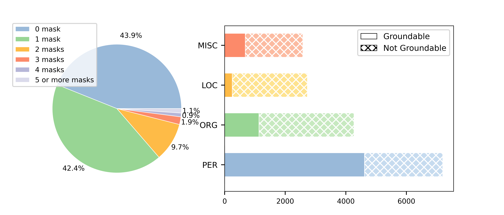

<div align="center">

<h1>LLMs as Bridges: Reformulating Grounded Multimodal Named Entity Recognition</h1>

[](https://paperswithcode.com/sota/grounded-multimodal-named-entity-recognition?p=llms-as-bridges-reformulating-grounded)
[](https://paperswithcode.com/sota/segmented-multimodal-named-entity-recognition?p=advancing-grounded-multimodal-named-entity)
</div>

<br>

<div align="center">

</div>

Here are code and datasets for our Findings of ACL 2024 and further extended paper: [LLMs as Bridges: Reformulating Grounded Multimodal Named Entity Recognition](https://arxiv.org/pdf/2402.09989) & [Advancing Grounded Multimodal Named Entity Recognition via LLM-Based Reformulation and Box-Based Segmentation](https://arxiv.org/abs/2406.07268)

# News🔥

 - 📆 **[Aug. 2024]** [Twitter-SMNER dataset](https://github.com/JinYuanLi0012/RiVEG/tree/main?tab=readme-ov-file#twitter-smner-dataset) has been released.
 - 📆 **[Jun. 2024]** A [new research](https://arxiv.org/abs/2406.07268) has been released. We propose a new Segmented Multimodal Named Entity Recognition (SMNER) task and construct the corresponding Twitter-SMNER dataset. Twitter-SMNER dataset coming soon~🔨
 - 📆 **[May. 2024]** RiVEG has been accepted to ACL 2024 Findings.
 - 📆 **[Oct. 2023]** [PGIM](https://github.com/JinYuanLi0012/PGIM) has been accepted to EMNLP 2023 Findings.

# Todo List

 - [x] Release datasets and training and inference scripts at each stage.
 - [x] Release new Twitter-SMNER dataset.

# Twitter-SMNER Dataset
</div>

<br>

<div align="center">

</div>

Our Twitter-SMNER dataset is a further development of the [Twitter-GMNER dataset](https://github.com/NUSTM/GMNER):

 - Step 1: Download each tweet's associated images via this link (https://drive.google.com/file/d/1PpvvncnQkgDNeBMKVgG2zFYuRhbL873g/view)
 - Step 2: Download the segmentation mask in json format and the preprocessed CoNLL format files via this link (https://drive.google.com/file/d/1LvC6KkzlFiv3KKhbZIFsSvt7ZeafC2g2/view?usp=sharing). Each json file contains the segmentation masks and named entity labels of all visual objects in the corresponding image.

Please note that the number of segmentation masks in the Twitter-SMNER dataset is not exactly the same as that in the Twitter-GMNER dataset, because we discarded a small number of entity visual objects that are not suitable for segmentation during the annotation process.

# Usage

The implementation of RiVEG mainly includes the following three parts:

## MNER Module

The MNER stage of RiVEG is mainly based on AdaSeq, AdaSeq project is based on Python version >= 3.7 and PyTorch version >= 1.8. For details on the configuration of the environment, see [PGIM](https://github.com/JinYuanLi0012/PGIM) and [AdaSeq](https://github.com/modelscope/AdaSeq).

After following the instructions of PGIM to complete the configuration, use the following commands to complete the training and prediction of the MNER stage.
Note that we have provided RiVEG's yaml configuration file, please replace the original configuration of PGIM with the configuration file [here](MNER/twitter-10000.yaml).
```
python -m scripts.train -c examples/PGIM/twitter-10000.yaml
```

After completing training, the inference results will be saved in **experiments/RiVEG-twitter-10000/.../pred.txt**.

## Visual Entailment Module

The VE stage of RiVEG is mainly based on [OFA](https://github.com/OFA-Sys/OFA), please configure the corresponding environment according to its instructions.

RiVEG's VE data are available [here](https://drive.google.com/drive/folders/153WtZiHHZBzxSG8Sk76byPRynlt-nUl3?usp=sharing). Download these data and place them in the **OFA/dataset/snli_ve_data/** folder. 

We have provided the **twitter10000_addent_test_pred.tsv** file which contains the ChatGPT answers. If you want to obtain the corresponding VE test set based on your own MNER inference results, you can run the corresponding code we provide [here](data_processing/MNER_processing). First put the MNER prediction results **experiments/RiVEG-twitter-10000/.../pred.txt** into the **data_processing/MNER_processing** folder, and then run the **extract entities.py** and **GPT request.py** files in sequence. The GPT answer will be written into **data_processing/MNER_processing/testAnswer.txt**. Note that line 9 of the **GPT request.py** file needs to be replaced with your own key. And there will be a small amount of expenses. 

After this, use [Twitter10000_to_OFA_VE.py](data_processing/VE_processing
) file to get the final tsv dataset, don't forget to replace lines 40 and 122 with the xml and img data paths of the original [GMNER dataset](https://github.com/NUSTM/GMNER).

Same usage as [OFA_Visual Entailment](https://github.com/OFA-Sys/OFA#visual-entailment), then use the [script](VE) we provide to perform training and inference. Please pay attention to the modification of various file paths.
```
cd run_scripts/snli_ve
nohup sh train_twitter10000.sh > train_twitter10000.out &  # finetune for twitter10000_VE
sh evaluate_twitter10000.sh test  # inference and specify 'dev' or 'test'
```

The inferred VE results will be stored in **OFA/results/snli_ve_twitter10000pred/_predict.json**.

## Visual Grounding Module

Same as VE Module, the VG stage of RiVEG is also based on [OFA](https://github.com/OFA-Sys/OFA).

RiVEG's VG data are available [here](https://drive.google.com/drive/folders/1Tc_oNEixbcRcxuVVXgdp4gAmEfB2ZAcv?usp=sharing). Download these data and place them in the **OFA/dataset/refcoco_data/** folder. 

Similarly, we have provided the preprocessed **twitter10000REC_addent_test_pred.tsv** file. You can also make your own test set by running [Twitter10000_to_OFA_REC.py](data_processing/VG_processing) to convert VE predictions **_predict.json** to VG input. Don't forget to replace line 98 of it with your own GMNER img path. 

Same usage as [OFA_Visual Grounding](https://github.com/OFA-Sys/OFA#visual-grounding-referring-expression-comprehension), then use the [script](VG) we provide to perform training and inference. Please pay attention to the modification of various file paths.
```
cd run_scripts/refcoco
nohup sh train_twitter10000REC.sh > train_twitter10000REC.out &  # finetune for twitter10000_VG
sh evaluate_twitter10000REC.sh test  # inference and specify 'dev' or 'test'
```
The inference results of Visual Grounding are located at **../results/twitter10000REC/OFAlargeVE_OFAlargeREC_pred/refcoco_val_predict.json**

## Result statistics

If you did not build the test set yourself, you can directly obtain the statistical results by running [statistics.py](statistic). Note that you need to modify its 12 lines to your **../results/twitter10000REC/OFAlargeVE_OFAlargeREC_pred/refcoco_val_predict.json** file. 

If you build the test set yourself, first replace the original path with your own **data_precessing/VG_precessing/OFAVE_to_OFAREC.txt** on line 4, and then use your **../results/twitter10000REC/OFAlargeVE_OFAlargeREC_pred/refcoco_val_predict.json** on line 12 to get the statistical results. 

# Citation
If you find RiVEG useful in your research, please consider citing:

```
@inproceedings{li2023prompting,
  title={Prompting ChatGPT in MNER: Enhanced Multimodal Named Entity Recognition with Auxiliary Refined Knowledge},
  author={Li, Jinyuan and Li, Han and Pan, Zhuo and Sun, Di and Wang, Jiahao and Zhang, Wenkun and Pan, Gang},
  booktitle={Findings of the Association for Computational Linguistics (EMNLP), 2023},
  year={2023}
}

@inproceedings{li2024llms,
  title={LLMs as Bridges: Reformulating Grounded Multimodal Named Entity Recognition},
  author={Li, Jinyuan and Li, Han and Sun, Di and Wang, Jiahao and Zhang, Wenkun and Wang, Zan and Pan, Gang},
  booktitle={Findings of the Association for Computational Linguistics (ACL), 2024},
  year={2024}
}

@article{li2024advancing,
  title={Advancing Grounded Multimodal Named Entity Recognition via LLM-Based Reformulation and Box-Based Segmentation},
  author={Li, Jinyuan and Li, Ziyan and Li, Han and Yu, Jianfei and Xia, Rui and Sun, Di and Pan, Gang},
  journal={arXiv preprint arXiv:2406.07268},
  year={2024}
}
```

# Acknowledgement
The dataset we used is provided by [H-Index](https://github.com/NUSTM/GMNER). And our code is built upon the open-sourced [AdaSeq](https://github.com/modelscope/AdaSeq), [MoRe](https://github.com/modelscope/AdaSeq/tree/master/examples/MoRe), [OFA](https://github.com/OFA-Sys/OFA). Thanks for their great work!
